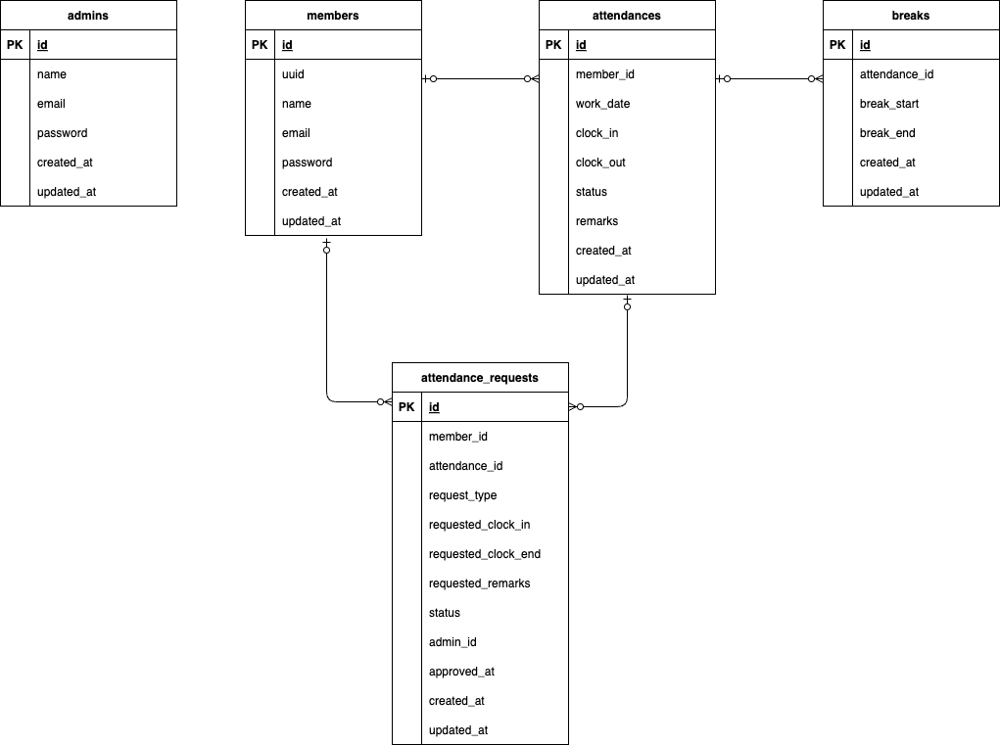

# time_log（勤怠管理アプリ）

企業開発の独自勤怠管理アプリ  
メール認証によって、認証済みユーザのみが操作を行える  
一般ユーザは勤怠申請、管理者ユーザは勤怠管理を行える

## 環境構築

**Docker ビルド**

1. アプリケーションをクローンするディレクトリに移動
2. `git clone git@github.com:Koharu5810/time_log.git`
3. `cd time_log`
4. DockerDesktop アプリを立ち上げる（`open -a docker`）。
5. `docker-compose up -d --build`

**Laravel 環境構築**

1. `docker-compose exec php bash`
2. `composer install`
3. 「.env.example」ファイルを 「.env」ファイルに命名を変更。  
    または、新しく.env ファイルを作成（`cp .env.example .env`）。
4. .env に以下の環境変数を追加

```text
DB_CONNECTION=mysql
DB_HOST=mysql
DB_PORT=3306
DB_DATABASE=laravel_db
DB_USERNAME=laravel_user
DB_PASSWORD=laravel_pass

MAIL_MAILER=smtp
MAIL_ENCODING=UTF-8
MAIL_HOST=mailhog
MAIL_PORT=1025
MAIL_USERNAME=test
MAIL_PASSWORD=pass
MAIL_ENCRYPTION=null
MAIL_FROM_ADDRESS=test@abc.com
MAIL_FROM_NAME="${APP_NAME}"
```

5. アプリケーションキーの作成

```bash
php artisan key:generate
```

6. マイグレーションの実行

```bash
php artisan migrate
```

7. シーディングの実行

```bash
php artisan db:seed
```

8. シンボリックリンクの作成

``` bash
php artisan storage:link
```

<!-- 9. テスト用データベースの設定

まずテスト用の環境変数ファイルを作成する
``` bash
cp .env .env.testing
```
作成したファイルに以下を記載し、テスト用データベース設定に変更する
``` bash
APP_ENV=testing
APP_KEY=base64:テスト用キー
APP_DEBUG=true
APP_URL=http://localhost

DB_CONNECTION=mysql
DB_HOST=mysql
DB_PORT=3306
DB_DATABASE=laravel_test_db
DB_USERNAME=root
DB_PASSWORD=root
```
テスト用データベースを作成
phpunit.xmlの設定確認
テスト用データベースにマイグレーションとシーディングを適用する
``` bash
php artisan migrate --env=testing
php artisan db:seed --env=testing
``` -->
<br>

**会員登録後のメール認証**

アプリケーションをブラウザで確認時に、会員登録画面で登録後メール認証を行うには  
http://localhost:8025  
へダイレクトし、本文記載の認証ボタンをクリックする。
<br><br>


## 使用技術(実行環境)

| 言語・フレームワーク | バージョン |
| :------------------- | :--------- |
| PHP                  | 8.3.13     |
| Laravel              | 8.83.27    |
| MySQL                | 9.0.1      |
| Stripe               | 9.9.0      |
| MailHog              |            |

## ER 図



## URL

- 開発環境 : http://localhost/
- phpMyAdmin : http://localhost:8080/
- MailHog : http://localhost:8025/
